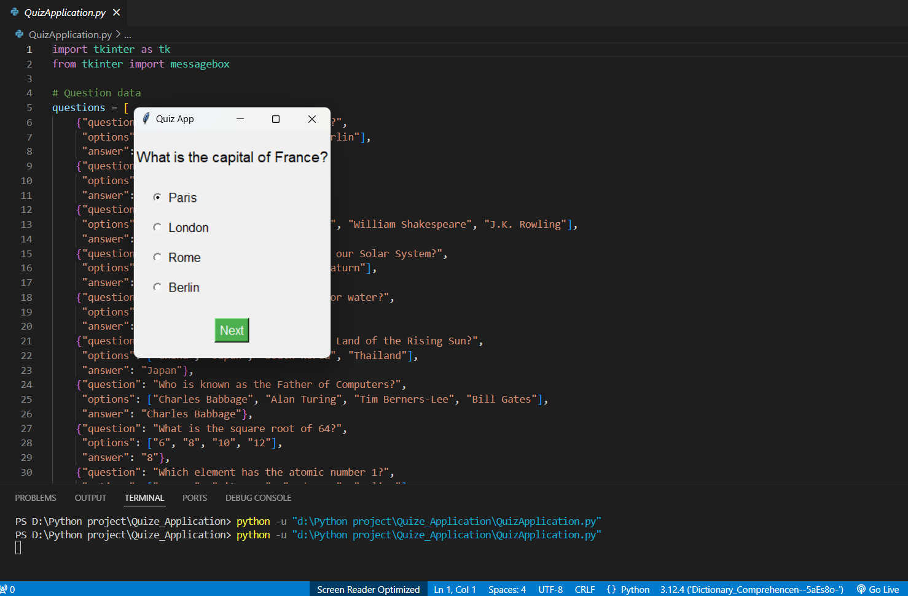
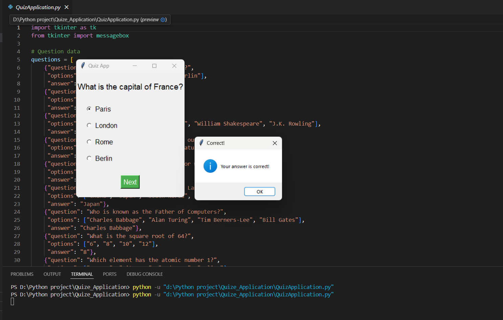
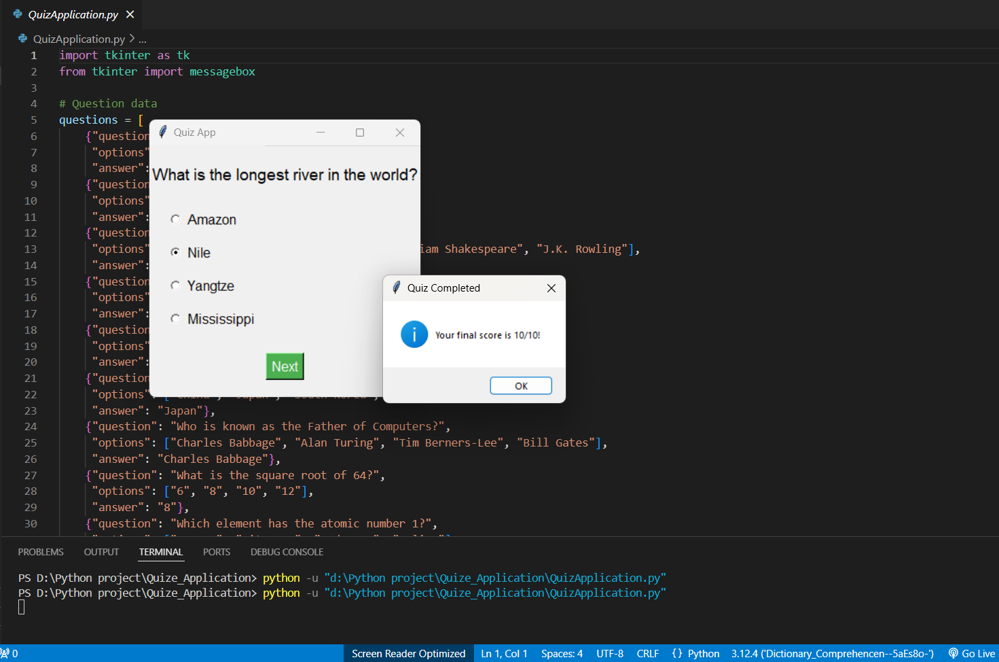

# Quiz-Application 🎯

A GUI-based Python quiz application built using Tkinter. This application allows users to answer 10 multiple-choice questions, providing instant feedback and a final score summary.

---

## ✨ Features

- **Interactive GUI**: Easy-to-use interface built with Tkinter.
- **Multiple-Choice Questions**: Users can select answers from four options.
- **Real-Time Feedback**: Message boxes display correct or incorrect answers after each question.
- **Score Tracking**: Final score displayed at the end of the quiz.
- **Customizable Questions**: Easy to modify or add new questions in the code.

---

## ⚙️ Installation

Follow these steps to set up the application on your system:

1. **Clone the repository:**
   ```bash
   git clone https://github.com/rahul886297/python-quiz-app.git
   
2. **Navigate to the project directory:**
  ```bash
    cd python-quiz-app
```
  

3. **Install Required Libraries: Ensure you have Python installed. Install Tkinter if not pre-installed:**
```bash
pip install tk
```

5. **Run the Application:**
```bash
python quiz_app.py
```

## 🚀 Usage

- **Launch the application using the command:
Copy code
python quiz_app.py
A GUI window opens with the first question.

Select your answer from the multiple-choice options.

Click the "Next" button to proceed to the next question.

At the end of the quiz, your total score is displayed.

## 🖼 Screenshots
### Choose the correct optiion.


### Difrent Question


### Score


**Author:** [Rahul Mandal](https://github.com/rahul886297) 
